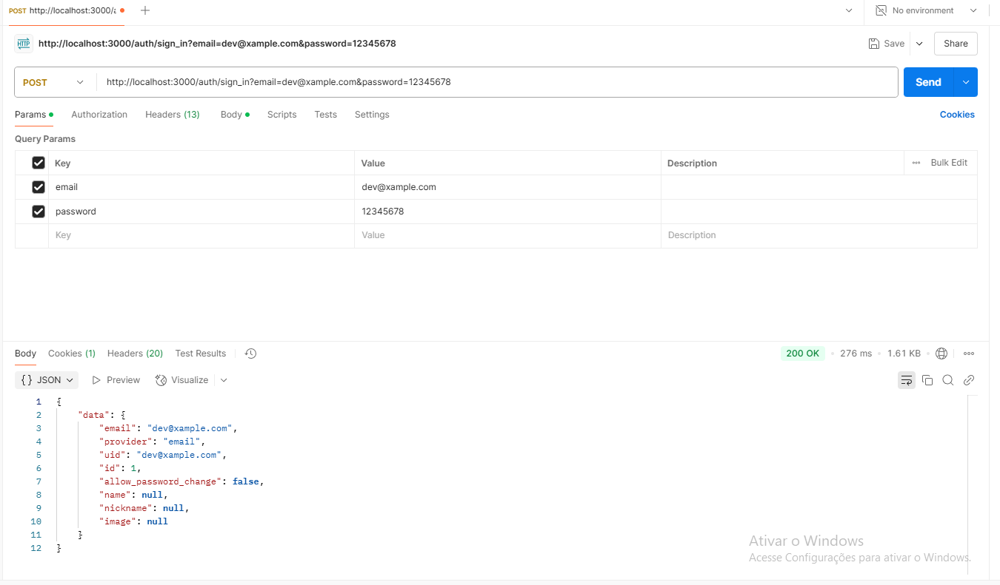
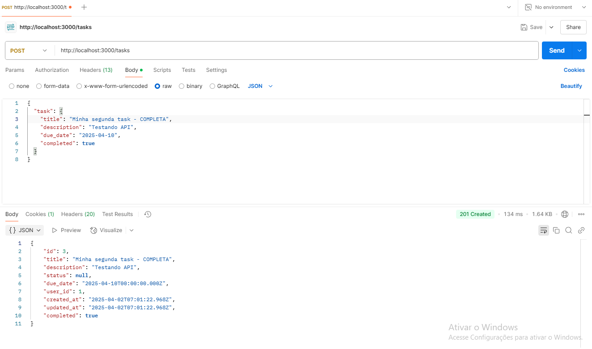

# 📌 To-Do List API | Ruby on Rails

### An API to manage tasks ans goals

## ✨ Structure

- **Ruby on Rails** (API Mode)
- **Devise Token Auth** (Token Authentication)
- **Letter Opener** (Testes de e-mail em ambiente local)
- **RSpec** (Testes automatizados)

---

## 🚀 How to install and execute

### 📦 Dependencies and versions

Be sure that ypu have installed:

- Ruby 3.2+
- Rails 7+
- PostgreSQL (or SQLite for local tests)

### 🔧 Guide

1. Clone the repository:

   ```bash
   git clone https://github.com/murilo-cavalcante-lima/todo_app.git
   cd todo_app
   ```

2. Install dependencies:

   ```bash
   bundle install
   ```

3. DB Config:

   ```bash
   rails db:create db:migrate db:seed
   ```

4. Run the application:

   ```bash
   rails s
   ```
---

## 🔑 Authentication

On Rails API mode, the Devise does not support authentications via cookies, so the API uses **Devise Token Auth** for authentication via token.

```bash
rails generate devise_token_auth:install User auth
```

Now the access token is available by request:
```
curl -X POST http://localhost:3000/auth/sign_in -d "email=user_email&password=user_password"
```
the response header must have the credentials (access-token, client, uid)



### 🔹 Create User

```bash
curl -X POST http://localhost:3000/auth/ \
     -d "email=User@email.com&password=12345678&password_confirmation=12345678"
```

### 🔹 Login

```bash
curl -X POST http://localhost:3000/auth/sign_in \
     -d "email=teste@email.com&password=12345678"
```

> The login returns a **token** on the response headers, wich must be sent in all the protected requisitions.

---

## 📌 Endpoints


### 📌 Tasks

| Méthod | Route       | Description                  | Protected? |
| ------ | ----------- | -------------------------- | ------------ |
| POST   | /tasks      | Criar nova tarefa          | ✅ Sim        |
| GET    | /tasks      | Listar tarefas (paginadas) | ✅ Sim        |
| PUT    | /tasks/\:id | Atualizar tarefa           | ✅ Sim        |
| DELETE | /tasks/\:id | Remover tarefa             | ✅ Sim        |

---

## ⏰ overdue tasks notification service

A **Async Job** verifies periodically if there are no completed tasks and sends a notification email to the user.

> To test locally, the service uses the gem **Letter Opener**. After running Sidekiq the service can be seen in the browser.

For this service to work properly, the environment file must be configurated according with the email preferences, locally it can be tested like this:
```
TaskMailer.overdue_task_email(Task.first).deliver_now
```


---
----------- [WIP]-----------------------

## ✅ Tests

Para rodar os testes automatizados com **RSpec**:

```bash
rspec
```

---

## 📌 Next Steps

- ✅ Create font-end interface
- ✅ Code tests
- ✅ Add validations to tasks

---

## 📢 Contribuitions

Feel free to open issues and pull requests! 😉

---

**CreatedBy ****[Murilo Cavalcante Lima](https://github.com/murilocavalcantelima)** 🚀


